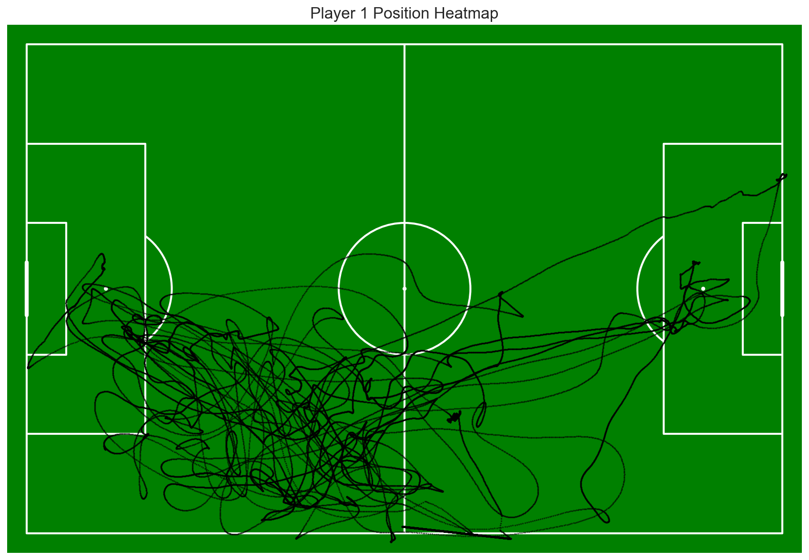
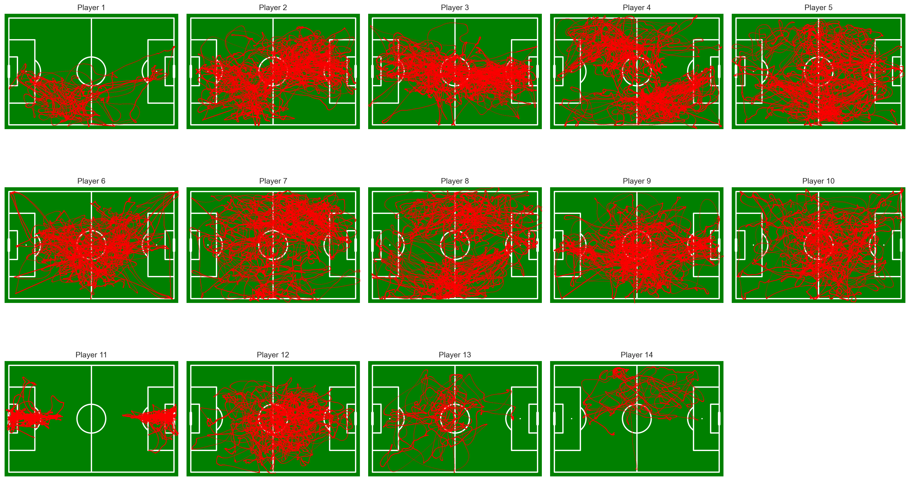
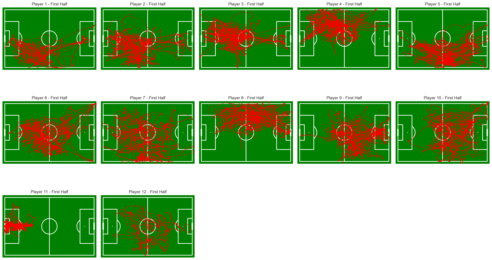
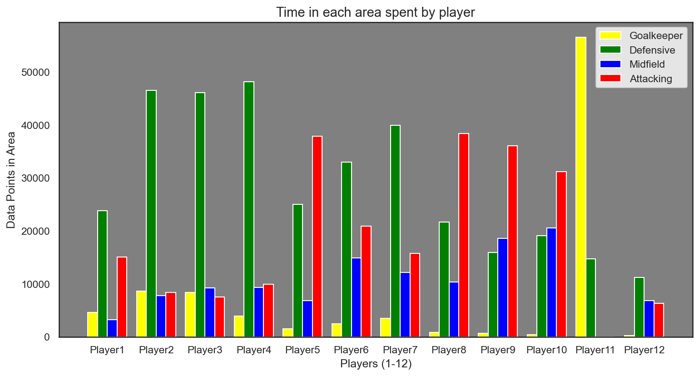

# Player Position Prediction

**Author:** Shuhib Noorestani

## Project Overview

This project explores whether we can predict a football player's position based purely on their movement data. Using tracking data from Metrica Sports, I built an algorithm that analyses where players spend their time on the pitch and classifies them into four roles: Goalkeeper, Defender, Midfielder, or Attacker.

## Project Structure

```
├── main.ipynb                    # Jupyter notebook with full analysis
├── sample-data/                  # Metrica Sports tracking data (cloned from GitHub)
│   └── data/
│       └── Sample_Game_1/
│           ├── Sample_Game_1_RawTrackingData_Home_Team.csv
│           └── Sample_Game_1_RawTrackingData_Away_Team.csv
└── README.md
```

## Features

- **Data Cleaning**: Renaming columns from raw CSV format to usable Player_x and Player_y coordinates
- **Pitch Visualization**: Football pitch heatmaps using the mplsoccer library
- **Side Detection**: Algorithm to detect which side of the pitch a team is playing from using goalkeeper position
- **Area Classification**: Dividing the pitch into GK, Defensive, Midfield, and Attacking zones
- **Position Prediction**: Classifying players based on X/Y averages and variance analysis

## Methodology

The approach I took was to:
1. Plot each player's position throughout the match to visualise their movement patterns
2. Use the goalkeeper as an anchor point to determine which direction the team is attacking
3. Divide the pitch into four zones and count how much time each player spends in each area
4. Apply thresholds based on average X position and variance to predict their role

## Visualizations

### Player 1 Position Heatmap
Individual scatter plot showing Player 1's movement across the entire match, plotted on a football pitch.



### All Players Heatmaps (Full Match)
Position scatter plots for all 14 players. This revealed Player 11 as the goalkeeper immediately, and showed Players 12-14 as substitutes with significantly less data.



### First Half Player Heatmaps
Filtered to show only first-half data, which gives cleaner position analysis without the teams switching sides at half-time.



### Time Spent in Each Area
Bar chart showing data points per player across the four pitch zones. Player 11 clearly spends almost all their time in the GK area, confirming our visual analysis.



## Results

The algorithm predicted the following positions for the first half:

| Player | Position | Avg X | Avg Y |
|--------|----------|-------|-------|
| Player 1 | Defender | 0.442 | 0.749 |
| Player 2 | Defender | 0.397 | 0.653 |
| Player 3 | Defender | 0.403 | 0.488 |
| Player 4 | Defender | 0.415 | 0.303 |
| Player 5 | Attacker | 0.559 | 0.741 |
| Player 6 | Midfielder | 0.515 | 0.541 |
| Player 7 | Defender | 0.470 | 0.629 |
| Player 8 | Attacker | 0.589 | 0.259 |
| Player 9 | Midfielder | 0.647 | 0.576 |
| Player 10 | Midfielder | 0.621 | 0.514 |
| Player 11 | Goalkeeper | 0.125 | 0.487 |
| Player 12 | Midfielder | 0.525 | 0.569 |

**Summary:** 1 Goalkeeper, 5 Defenders, 4 Midfielders, 2 Attackers

## Key Findings

- The goalkeeper was identified with 100% confidence using low X-variance (0.007) and central Y-positioning
- Using the goalkeeper's average X-position (0.125), I confirmed the home team started from the left side of the pitch
- The predictions align reasonably well with typical football formations

## Limitations

Football is tactically complex, and this approach has some clear limitations:
- Wing-backs push forward into attacking areas, making them look like midfielders
- Defensive midfielders drop deep, blurring the line between defence and midfield
- Set pieces like corners cluster all players in one area, skewing the data
- Modern tactics like high pressing lines can push defenders much further up the pitch

## Future Improvements

- Filter out set-piece situations using ball position data
- Weight the analysis by game phase (attacking vs defending)
- Use K-Means clustering instead of fixed thresholds
- Test across multiple matches to validate the approach

## Technologies Used

- Python
- Pandas & NumPy
- Matplotlib & Seaborn
- mplsoccer
- scikit-learn

## Data Source

[Metrica Sports Sample Data](https://github.com/metrica-sports/sample-data)
